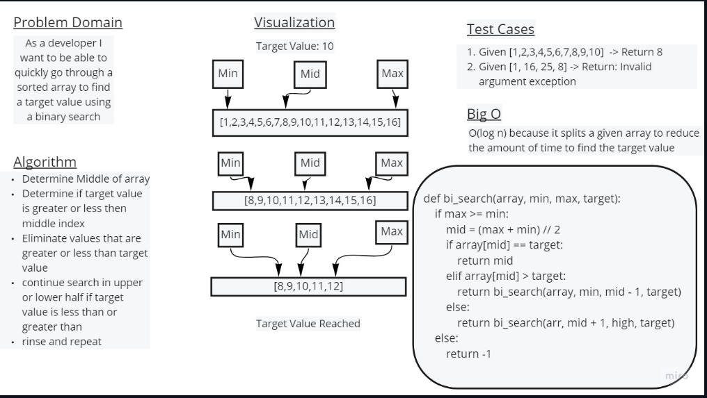

# Binary Search of an array
walking through the array trying to find the value with the minimum and maximum values

## Whiteboard Process

## Approach & Efficiency

Find minimuim and maximum value and find the value to target, max, and middle values, get rid of  values greater than or less than middle value and repeat until target value has been reached.
