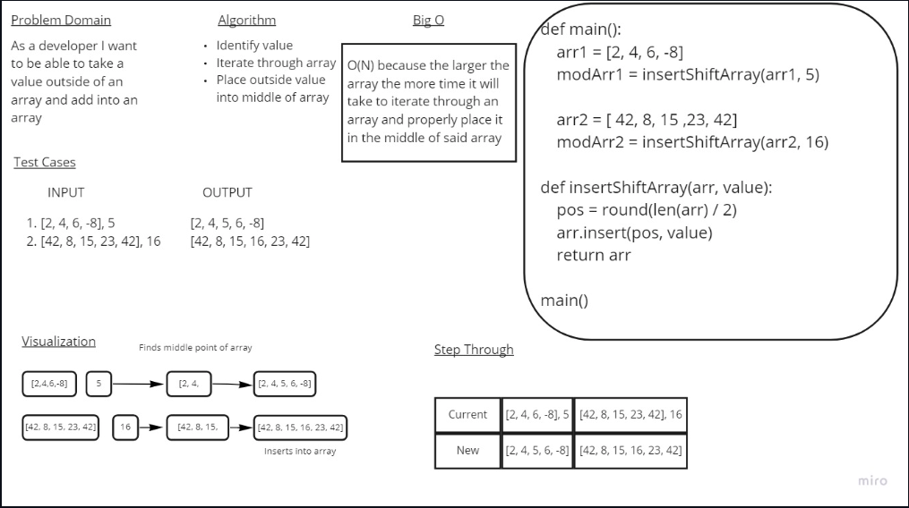

# Insert to Middle of an Array

Taking a value outside of an array and placing into the middle of an array

## Whiteboard Process

## Approach & Efficiency

iterate through an array and find the middle point to insert the outside value.
