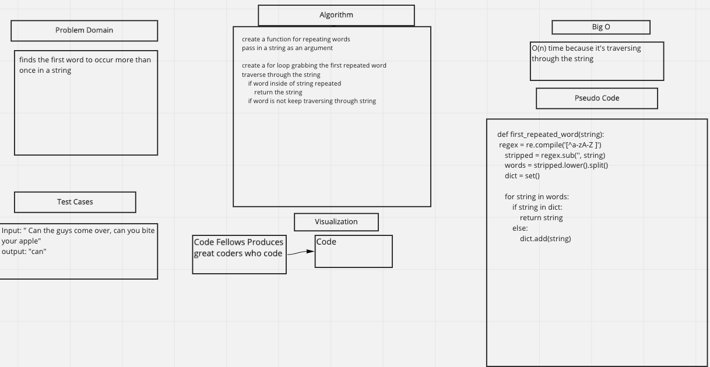

# Challenge Summary
- finds the first word to occur more than once in a string and return the string

## Whiteboard Process

## Approach & Efficiency
- the Big O notation is 0(n)time because it is traversing through a string

