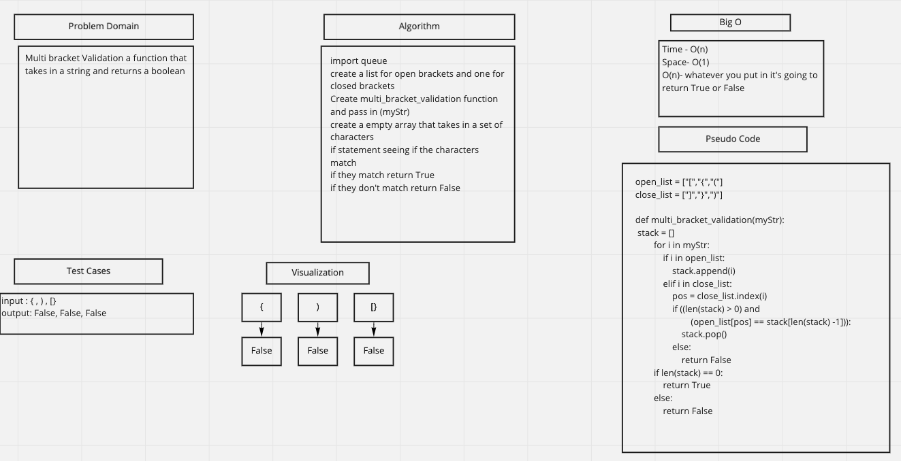

# Challenge Summary
- Multi bracket Validation a function that takes in a string and returns a boolean

## Whiteboard Process

## Approach & Efficiency
- Time - O(n)
- Space- O(1)
- O(n)- whatever you put in it's going to return True or False

## Solution
open_list = ["[","{","("]

close_list = ["]","}",")"]

def multi_bracket_validation(myStr):

        stack = []
        for i in myStr:
            if i in open_list:
                stack.append(i)
            elif i in close_list:
                pos = close_list.index(i)
                if ((len(stack) > 0) and
                        (open_list[pos] == stack[len(stack) - 1])):
                    stack.pop()
                else:
                    return False
        if len(stack) == 0:
            return True
        else:
            return False
## Collaborators
- Alec, Ryan, Riki
