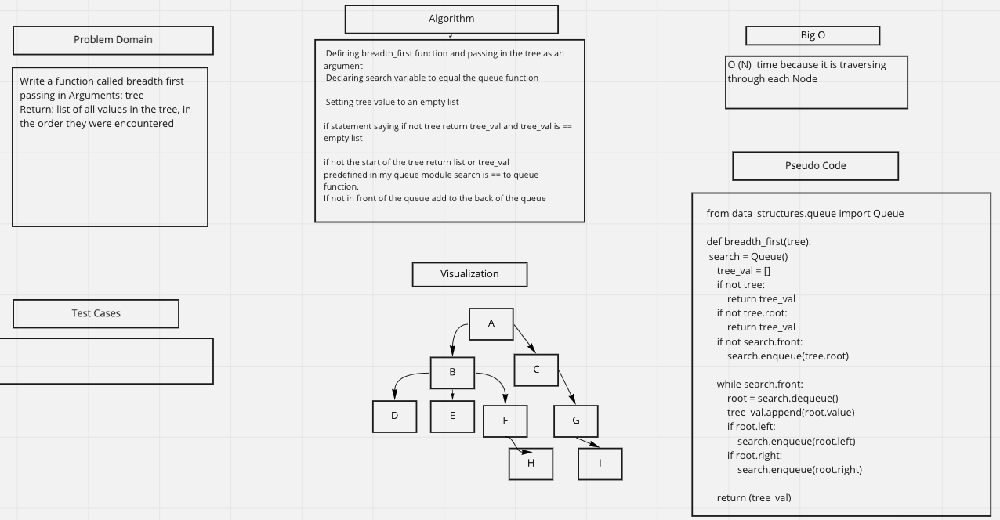

# Challenge Summary
- Write a function called breadth first
passing in Arguments: tree
Return: list of all values in the tree, in the order they were encountered

## Whiteboard Process
<!-- Embedded whiteboard image -->

## Approach & Efficiency
- Big O notation is time because it is traversing through each Node

