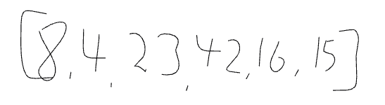
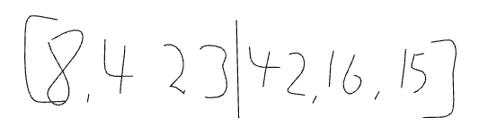
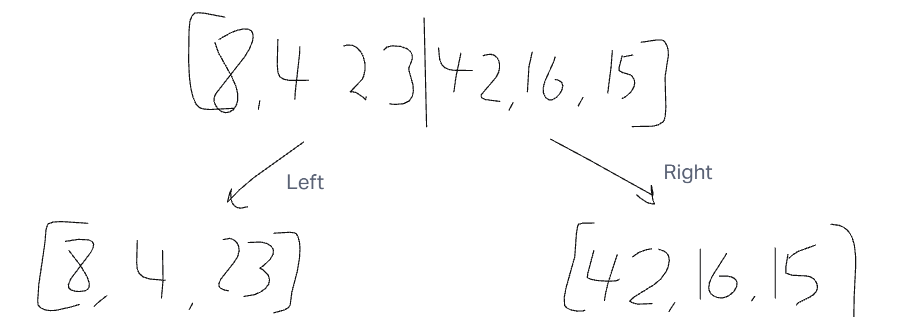
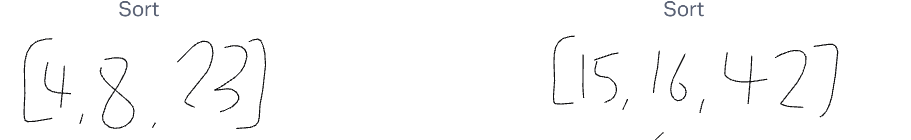
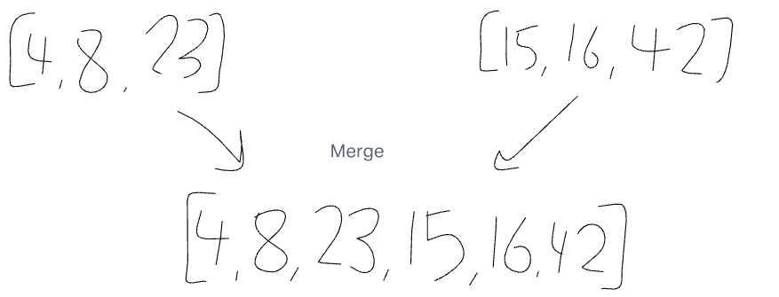
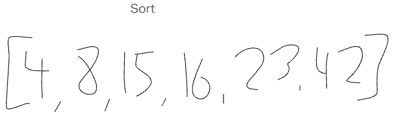

# Blog Notes: Merge Sort

We are given an original input full of randomized numbers. It is going to be used as an example to test out the merge method.

Now the variable n is defined by the number of values in the list and it will be split in half to become two different arrays (left and right).

The values are split into two different arrays because it will make them easier to sort. In this specific example the left array will be [8, 4, 23] and the right array will be [42, 16, 15].

Once the two arrays are split they will be sorted in numerical order. So the left array will be sorted as [4, 8, 23] and the right array will be sorted as [15, 16, 42].

After both of the arrays are sorted they will then be merged together. They were split at first to sort pieces instead of the whole list as one to make it easier to sort. Once the merge is done the two arrays will become one again. In this example it will be [4, 8, 23, 15, 16, 42].

The final step in this process is the final sorting of the merged list. The final sorting is to make sure the final merge is correctly sorted numerically. In this example the final sorting will result in a list of [4, 8, 15, 16, 23, 42].

## Collab
- Ryan Alec Riki
