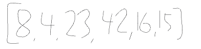
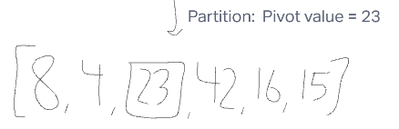
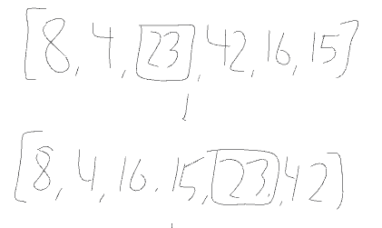
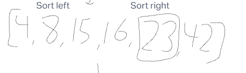
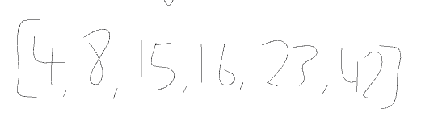

We are given a basic list of scrambled numbers. The list is what our quick_sort program will take in and begin to look for a partition.

The partition value will be equal to the halved value of the array length. In this example there are six values and halving six would give us three. The third value is 23 and so this will become the pivot value.

The swap method within the partition function will look for all values that are less than the pivot value and place them to the left of it. The same will happen with the values that are greater than the pivot value except they will be placed to the right of it. The lowest value will also be identified and make sure there are no numbers less than it.

Once the values are swapped and on their proper side of the pivot value, they will then be sorted amongst each side. The left side will sort itself making sure the numbers are in numerical order based on the lowest number and the pivot value. The same will occur with the right side.

This final image contains the final product of the list after undergoing the quick_sort algorithm.

# Blog Notes: Quick Sort

## Collab
- Alec, Ryan, Riki
